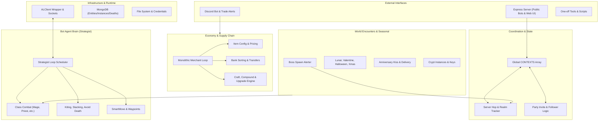
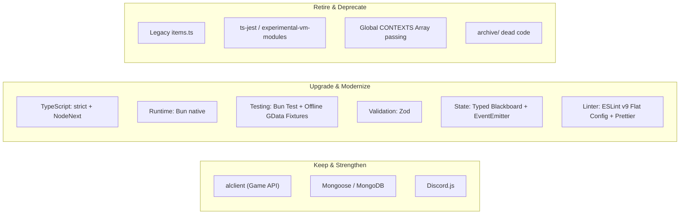

# AdventureLand Multi-Agent Bot Platform: Architectural Analysis & Modernization Plan

## Goal Description

The objective of this proposal is to establish a clear architectural vision, modular domain boundaries, modernized tooling, and a phased refactoring roadmap for the `adventureland-bots` codebase. 

The workspace is a sophisticated, real-time autonomous multi-character MMORPG botting platform. However, rapid evolution and feature accumulation have resulted in severe technical debt: **3,000+ line monolithic files**, **untyped global state arrays (`CONTEXTS`)**, **duplicate legacy logic (`items.ts` vs `itemsNew.ts`)**, **loose `setTimeout` loops without lifecycle guarantees**, and **tests that fail due to live network dependencies**.

This plan outlines how to evolve the platform into a decoupled, testable, high-performance system powered by modern TypeScript, domain-driven boundaries, a typed Blackboard & Event Bus architecture, and an offline-capable testing suite—**without breaking existing bot operations during the transition**.

---

## User Review Required

> [!IMPORTANT]
> **No files will be modified or moved until this plan is reviewed and approved.** 
> Please review the architectural principles, directory layout, recommended tech stack, and phased roadmap below.

> [!WARNING]
> **Key Architectural Decisions to Confirm:**
> 1. **Runtime & Package Manager**: Standardizing on **Bun** (already installed in the environment) for package management, TypeScript execution, and native testing (`bun test`).
> 2. **State & Coordination Model**: Replacing the ad-hoc global `CONTEXTS` array with a **Typed Blackboard Pattern** + **In-Memory Event Bus**, eliminating direct cross-bot object mutations.
> 3. **Consolidation of Item Configurations**: Retiring legacy `items.ts` and splitting `itemsNew.ts` (1,712 lines) into pure data schemas and domain services.
> 4. **Modernized AI / Decision-Making**: Transitioning from 1,000ms polling strategy-swapping to a **Hierarchical State Machine (HSM) / Utility AI** selector for bot modes (Combat, Replenish, Banking, Event Bosses).

---

## 1. System & Domain Analysis

### 1.1 Core Functional Domains Identified



1. **Client Lifecycle & Transport Layer**:
   - Manages connection, heartbeat, authentication, reconnection backoff, and socket events via `alclient`.
   - Prepares and queries `AL.Pathfinder` with map geometry.
2. **Bot Agent Architecture (`Strategist`)**:
   - Manages individual character instances (`PingCompensatedCharacter` subclasses: `Mage`, `Merchant`, `Paladin`, `Priest`, `Ranger`, `Rogue`, `Warrior`).
   - Maintains a set of active `Strategy` instances, executing periodic `loops` via recursive `setTimeout`.
3. **Multi-Bot Party & Realm Orchestration**:
   - Coordinates multi-bot compositions (e.g. 1 Merchant + 1 Warrior + 1 Mage + 1 Priest).
   - Manages party formation, party leader following, and synchronized cross-realm server hops for rare spawns.
4. **Combat & Tactical Execution**:
   - Class-specific combat strategies (`attack_mage.ts`, `attack_priest.ts`, etc.) handling cooldowns, mana efficiency, burst skills, and optimal positioning.
   - Situational survival tactics: `AvoidDeathStrategy`, `AvoidStackingStrategy`, `PartyHealStrategy`, and dynamic kiting.
5. **Encounter & Monster Setups**:
   - Over 50 monster setup configurations (`setups/*.ts`) specifying character requirements, weapon/gear filters, and movement patterns.
6. **Economy, Logistics & Crafting**:
   - Autonomous supply chain: merchant replenishment trips, bank storage and sorting, stand sales, Ponty secondhand deal sniping, item crafting, upgrading, and compounding.
7. **World State & Live Events**:
   - Boss tracking (Franky, Ice Golem, Crabxx, Snowman, Dragold), seasonal event handlers (Lunar New Year, Valentines, Halloween, Christmas, Anniversary), and dungeon instance management (Crypt, Tomb).
8. **External Interfaces & Operations**:
   - Express REST API for guest onboarding (`earthiverse.ts` / `earthiverse.html`).
   - Discord bot integrations for trade alerts, market patron tracking, and administrative commands.
   - Standalone maintenance scripts in `source/tools/`.

---

### 1.2 Anti-Patterns, Tight Coupling & Architectural Bottlenecks

| Problem Area | Current Anti-Pattern | Impact / Bottleneck |
| :--- | :--- | :--- |
| **Monolithic God Files** | `source/merchant/strategy.ts` (3,109 lines) handles 16 different responsibilities in a single class. `source/earthiverse.ts` (1,372 lines) mixes HTTP routing, global state, bot spawning, and event loops. | High cognitive load, frequent merge conflicts, impossible to unit-test individual merchant behaviors in isolation. |
| **Global State & Direct Mutation** | `const CONTEXTS: Strategist[] = []` is passed into nearly every strategy constructor (`new BaseStrategy(CONTEXTS)`). Strategies reach directly into other bots' internal instances. | Tight coupling between agents. Race conditions during server hops or reconnects. Hard to run multiple independent parties. |
| **Parallel / Zombie Codebases** | `source/base/items.ts` (829 lines) and `source/base/itemsNew.ts` (1,712 lines) exist simultaneously. Some files import `items.js` and others import `itemsNew.js`. | Inconsistent behavior, duplicated bug fixes, confusion over which configuration is authoritative. |
| **Fragile Concurrency & Loops** | `Strategist` runs ad-hoc `setTimeout` loops without `AbortController`, task cancellation, or preemption. Strategy swapping (`swapStrategies`) runs every 1,000ms and thrashes loops. | Memory leaks from uncleared timeouts, unhandled promise rejections, and bots getting stuck mid-action during strategy transitions. |
| **Direct Library & DB Coupling** | Sockets and game objects (`bot.S`, `bot.s`, `bot.socket`) and Mongoose models (`InstanceModel.deleteMany`) are accessed directly in high-level game logic. | Zero isolation from upstream `alclient` breaking changes or MongoDB schema migrations. |
| **Type Safety Gaps** | `tsconfig.json` has `"noImplicitAny": false`. Excessive reliance on unchecked casts (`(bot.S.anniversary as any)?.available`). | Runtime `TypeError: cannot read property of undefined` errors occur during high-stakes combat or server hops. |
| **Untestable Codebase** | Only 3 test files exist (`upgrade.test.ts`, `items.test.ts`, `locations.test.ts`), and all fail because they require live internet access to `https://adventure.land/comm`. | No CI/CD regression protection; developers must test changes live in-game with real character assets. |

---

## 2. Recommended Tech Stack & Tooling Upgrades



### 2.1 Tooling & Dependency Matrix

| Tool / Technology | Current State | Recommendation | Justification |
| :--- | :--- | :--- | :--- |
| **Runtime & Execution** | Node.js via `npm` / partially `bun` | **Standardize on Bun** | The repository already contains `bun.lock` and Bun is installed. Bun provides sub-second startup, native TypeScript transpilation, and instant test execution. |
| **Compiler (`tsconfig.json`)** | `target: ES2020`, `module: ESNext`, `noImplicitAny: false`, `moduleResolution: node` | **Upgrade to `target: ES2022`, `moduleResolution: NodeNext`, `strict: true`** | Enforces true type safety across all 56k lines, eliminates silent null/undefined crashes, and cleanly resolves modern ES module imports. |
| **Schema Validation** | Custom runtime checks and string regexes | **Adopt Zod** | Strongly-typed validation for `credentials.json`, user settings, HTTP API inputs, and volatile server events (`bot.S` payloads). Generates TypeScript types automatically from schemas. |
| **State & Inter-Bot Messaging** | Global `CONTEXTS[]` array passed into class constructors | **Typed Blackboard + Event Bus** | Eliminates direct object reference coupling. Bots publish domain events (`ItemRequested`, `BossSpawned`, `ServerHopInitiated`) and query a shared, reactive blackboard. |
| **Decision-Making Engine** | 1,000ms polling `logicLoop` strategy swapping | **Hierarchical State Machine (HSM)** | Deterministic state transitions (Combat $\to$ Replenish $\to$ Banking $\to$ Event Hunting) with proper lifecycle hooks (`enter`, `exit`, `update`) and cancellation tokens. |
| **Testing Framework** | `jest` + `ts-jest` with experimental ESM flags (broken) | **Bun Test / Vitest with Mocked GData Fixtures** | Offline, deterministic unit tests for combat math, banking rules, upgrade probabilities, and merchant pricing running in milliseconds without network calls. |
| **Linting & Formatting** | ESLint v8 legacy format (`.eslintrc.json`) | **ESLint v9 Flat Config (`eslint.config.js`)** | Future-proof, faster linting, strict TypeScript rules, and consistent code style. |

---

## 3. Target Folder & Module Architecture

To provide separation of concerns and clear boundaries, the codebase will adopt a **Modular Layered Architecture with Bounded Domains**:

```text
adventureland-bots/
├── package.json
├── tsconfig.json
├── bun.lock
├── eslint.config.js
├── credentials.json.sample
│
├── tests/                           # Top-level test harness (zero network dependencies)
│   ├── fixtures/                   # Static mock data
│   │   ├── g_data.mock.json        # Offline game data (GData snapshot)
│   │   └── items_config.mock.json
│   ├── mocks/                      # Mock game clients, sockets, and entities
│   │   ├── mock_character.ts
│   │   └── mock_server.ts
│   └── unit/                       # Fast unit test suites
│       ├── combat/
│       ├── economy/
│       └── coordination/
│
├── source/
│   ├── core/                       # Shared framework & architectural primitives
│   │   ├── blackboard/             # Centralized shared state container
│   │   │   ├── team_blackboard.ts
│   │   │   └── character_blackboard.ts
│   │   ├── events/                 # Strongly-typed domain event bus
│   │   │   ├── event_bus.ts
│   │   │   └── domain_events.ts
│   │   ├── state_machine/          # Hierarchical State Machine primitives
│   │   │   ├── state.ts
│   │   │   └── state_machine.ts
│   │   ├── errors/                 # Standard domain error classes
│   │   └── logger/                 # Structured logging with log levels & Discord sink
│   │
│   ├── domain/                     # Bounded Business Domains (Pure logic, decoupled from I/O)
│   │   ├── character/              # Single bot representation & capabilities
│   │   │   ├── bot_controller.ts   # Resilient wrapper replacing Strategist
│   │   │   ├── lifecycle.ts        # Reconnection, backoff, authentication
│   │   │   └── skills/             # Class-specific action primitives
│   │   │
│   │   ├── team/                   # Multi-bot coordination
│   │   │   ├── party_coordinator.ts# Party invites, leader assignment, follower logic
│   │   │   ├── server_hopper.ts    # Synchronized realm hopping coordination
│   │   │   └── support_service.ts  # Cross-bot buffs (heal, rspeed, mluck, magiport)
│   │   │
│   │   ├── combat/                 # Combat tactics & rotations
│   │   │   ├── target_selector.ts  # Priority targeting & crowd control
│   │   │   ├── kite_controller.ts  # Positioning, kiting, distance control
│   │   │   ├── rotations/          # Pure class attack rotations
│   │   │   │   ├── mage_rotation.ts
│   │   │   │   ├── priest_rotation.ts
│   │   │   │   ├── warrior_rotation.ts
│   │   │   │   ├── ranger_rotation.ts
│   │   │   │   ├── paladin_rotation.ts
│   │   │   │   └── rogue_rotation.ts
│   │   │   └── setups/             # Encounter configurations (boar, franky, crypt...)
│   │   │       ├── encounter_registry.ts
│   │   │       └── encounters/     # Modular monster definitions
│   │   │
│   │   ├── economy/                # Logistics, trade, crafting
│   │   │   ├── inventory_manager.ts# Space optimization & item sorting
│   │   │   ├── bank_service.ts     # Deposit/withdrawal routines
│   │   │   ├── upgrade_service.ts  # Compounding, upgrading, scroll selection
│   │   │   ├── trade_service.ts    # Stand listings, pricing, Ponty deal finder
│   │   │   ├── crafting_service.ts # Recipe resolution and execution
│   │   │   └── merchant_brain.ts   # Modular merchant supervisor (replaces god file)
│   │   │
│   │   ├── items/                  # Unified item catalog & configuration
│   │   │   ├── item_schema.ts      # Zod schemas for item rules
│   │   │   ├── default_config.ts   # Clean, structured default item configs
│   │   │   └── item_queries.ts     # Pure helper queries (isSellable, shouldReplenish)
│   │   │
│   │   └── world/                  # World state, bosses & seasonal events
│   │       ├── boss_tracker.ts     # Live boss detection & alerts
│   │       ├── seasonal_events.ts  # Lunar, Valentines, Halloween, Christmas
│   │       ├── anniversary.ts      # Anniversary kiss claimer & visitor status
│   │       └── instances.ts        # Crypt, Tomb, Winter instance keys
│   │
│   ├── infrastructure/             # Concrete implementations (I/O, network, database)
│   │   ├── alclient/               # ALClient adapters & pathfinder bootstrap
│   │   ├── database/               # MongoDB repositories (Entities, Instances, Deaths)
│   │   ├── discord/                # Discord bot client, command handlers, alerts
│   │   └── http/                   # Fastify/Express API server & validation schemas
│   │
│   └── entrypoints/                # Executable application roots
│       ├── main.ts                 # Primary team runner (replaces earthiverse.ts)
│       ├── public_runner.ts        # Guest/public bot server
│       └── tools/                  # Maintained CLI maintenance scripts
```

### 3.1 Architectural Boundary Rules

1. **Dependency Direction (Strict Inward)**:
   - `core` has zero external dependencies on domain or infrastructure.
   - `domain` depends only on `core`. Domain logic never imports concrete database models or HTTP server objects.
   - `infrastructure` implements domain ports/interfaces and handles concrete SDKs (`alclient`, `mongoose`, `discord.js`).
   - `entrypoints` wire domain services and infrastructure together.
2. **Inter-Bot Decoupling**:
   - Bots must **never** hold direct references to each other's `PingCompensatedCharacter` objects.
   - Communication must occur via the `TeamBlackboard` (querying team member statuses) or `EventBus` (dispatching requests).
3. **Pure Logic vs. Game I/O**:
   - Calculation logic (calculating upgrade chance, finding optimal buy/sell price, sorting bank slots) must be pure functions with 100% test coverage.
   - Socket actions (`bot.upgrade()`, `bot.smartMove()`) are executed exclusively through leaf action services.

---

## 4. Implementation Plan & Migration Roadmap

To guarantee zero downtime and prevent regression in active farming, the refactoring will execute in **5 controlled, non-breaking phases**.

```mermaid
gantt
    title Modernization Roadmap
    dateFormat  X
    axisFormat  Phase %s

    section Phase 0
    Test Harness & Strict Tooling        :0, 1
    section Phase 1
    Core Primitives (Blackboard/Bus)    :1, 2
    section Phase 2
    Item Catalog & Merchant Refactor    :2, 3
    section Phase 3
    BotController & State Machine       :3, 4
    section Phase 4
    Infrastructure & Clean Entrypoint   :4, 5
    section Phase 5
    Legacy Deprecation & Clean Up       :5, 6
```



### Phase 0: Test Harness, Mock Fixtures & Strict Tooling
**Goal**: Establish an automated safety net before touching business logic.
- [NEW] Save offline snapshot of `GData` into `tests/fixtures/g_data.mock.json`.
- [NEW] Create `tests/mocks/mock_character.ts` and `tests/mocks/mock_server.ts`.
- [MODIFY] Fix existing tests (`items.test.ts`, `upgrade.test.ts`, `locations.test.ts`) to run offline against `mockGData`.
- [MODIFY] Configure `bun test` to run instantaneously across the suite.
- [MODIFY] Update `tsconfig.json` to enable `"strict": true` incrementally with path aliases (`@core/*`, `@domain/*`).

### Phase 1: Core Primitives (Blackboard & Event Bus)
**Goal**: Create the decoupled communication backbone alongside current code.
- [NEW] Implement `source/core/events/event_bus.ts` with typed events (`BossDetectedEvent`, `ReplenishRequestEvent`, `ServerHopRequestEvent`).
- [NEW] Implement `source/core/blackboard/team_blackboard.ts` tracking shared state (active realm, current boss target, team positions).
- [NEW] Add unit tests for Event Bus and Team Blackboard.
- *Compatibility*: Existing strategies continue running; new services can listen to or publish events without breaking legacy runners.

### Phase 2: Item System Consolidation & Merchant Decomposition
**Goal**: Eliminate the 3,109-line god file and dual `items.ts`/`itemsNew.ts` confusion.
- [NEW] Define Zod schema for item rules in `source/domain/items/item_schema.ts`.
- [NEW] Migrate `DEFAULT_ITEM_CONFIG` into clean, typed catalog entries; deprecate legacy `items.ts`.
- [NEW] Break `NewMerchantStrategy` down into focused domain services:
  - `InventoryManager` (replenishables, slot sorting)
  - `BankService` (deposit/withdraw logic)
  - `UpgradeService` (scroll selection, compounding, upgrading)
  - `TradeService` (stand listings, secondhand deals)
- [NEW] Comprehensive unit tests for item validation, upgrade odds, and banking math.

### Phase 3: Bot Controller & Hierarchical State Machine (HSM)
**Goal**: Replace fragile `setTimeout` loops with resilient, interruptible state machines.
- [NEW] Implement `source/core/state_machine/state_machine.ts` with `enter`, `update`, `exit`, and `AbortSignal` support.
- [NEW] Implement `BotController` replacing `Strategist` with robust reconnection backoff, error categorization, and heartbeat monitoring.
- [NEW] Implement high-level bot state transitions:
  - `CombatState`: Engages targets based on encounter setups.
  - `ReplenishState`: Moves to vendor/merchant to restock potions.
  - `BankingState`: Deposits excess loot and secures gold.
  - `EventBossState`: Interrupts normal farming to engage world boss or anniversary targets.
- *Compatibility*: `BotController` can run alongside existing `Strategist` during testing.

### Phase 4: Clean Infrastructure & Main Entrypoint
**Goal**: Modernize entrypoints and database interactions.
- [NEW] Implement MongoDB repository layer in `source/infrastructure/database/` to isolate direct Mongoose queries.
- [NEW] Implement `source/entrypoints/main.ts` replacing `earthiverse.ts`, using the new `PartyCoordinator`, `BotController`, and `TeamBlackboard`.
- [NEW] Clean Express API into typed controller routes with Zod schema validation.

### Phase 5: Legacy Deprecation & Cleanup
**Goal**: Remove dead code and archive debt.
- Safely remove `source/archive/` (over 10,000 lines of legacy scripts).
- Remove redundant duplicate files (`items.ts`, legacy runners).
- Verify clean compilation with zero warnings and 100% test pass rate.

---

## 5. Verification Plan

### Automated Test Suite
Run all unit and integration tests using Bun's native runner:
```bash
/home/hyprk/.bun/bin/bun test
```
- **Requirements**:
  - Must execute 100% offline (zero HTTP calls to `adventure.land`).
  - Execution time under 2 seconds.
  - Full coverage of critical business math: upgrade probability formulas, bank slot calculations, and item pricing rules.

### TypeScript Compilation & Linting
Verify strict type checking and linting standards:
```bash
/home/hyprk/.bun/bin/bun run build
/home/hyprk/.bun/bin/bun run lint
```
- **Requirements**:
  - Clean build under `tsc --strict` with zero type errors.
  - Zero `any` leaks in domain interfaces.

### Manual Bot Verification
1. Run single test character in isolated environment:
   ```bash
   /home/hyprk/.bun/bin/bun run source/entrypoints/main.ts
   ```
2. Verify:
   - Bot logs in and authenticates smoothly.
   - Event bus correctly publishes and receives events.
   - Bot navigates to assigned farming area and engages targets.
   - Potion replenishment and bank trips trigger appropriately when thresholds are reached.
   - Reconnections survive socket disconnects without leaking timeout loops.
